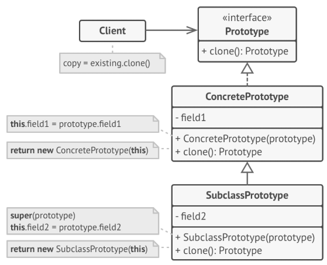

# Padrão de Projeto ✦ Prototype ✦

Também conhecido como: Protótipo, Clone

## ❥ Propósito

༄ O **Prototype** é um padrão de projeto criacional que permite criar cópias exatas de objetos existentes sem depender das suas classes concretas. Ele facilita a criação de novos objetos ao reutilizar protótipos já configurados, evitando a repetição de código e o acoplamento excessivo.

---

## ❥ Problema

༄ Quando precisamos copiar um objeto, a abordagem comum é criar uma nova instância da mesma classe e copiar manualmente todos os seus atributos. Porém, isso apresenta desafios:

- Nem todos os atributos podem ser acessados externamente, principalmente os privados.
- É necessário conhecer a classe concreta para criar uma cópia, o que gera dependência.
- Às vezes, o código só conhece a interface do objeto, não sua classe, dificultando a cópia.

༄ Essas limitações tornam o processo de clonagem complexo e rígido.

---

## ❥ Solução com o Prototype

O padrão Prototype resolve esses problemas ao delegar a responsabilidade da clonagem para o próprio objeto que será copiado. Para isso, todos os objetos clonáveis implementam uma interface comum, geralmente com um único método de clonagem.

Esse método cria uma nova instância da mesma classe e copia os dados necessários, inclusive os privados, pois o clone acontece internamente. Assim, o cliente pode clonar objetos sem saber sua classe concreta, aumentando a flexibilidade do sistema.

Além disso, protótipos pré-construídos podem ser mantidos em um registro para serem reutilizados e clonados conforme a necessidade.

---

## ❥ Estrutura do padrão

- **Interface Protótipo:** Define o método para clonagem.
- **Protótipos Concretos:** Implementam o método de clonagem, copiando os dados do objeto original para a nova instância.
- **Cliente:** Solicita a clonagem sem depender da classe concreta do objeto.

༄ Opcionalmente, pode existir um **registro de protótipos** que armazena objetos configurados para serem facilmente clonados.

---

## ❥ Aplicabilidade

༄ Use o padrão Prototype quando:

- Seu código precisa trabalhar com objetos sem depender das classes concretas deles.
- É necessário reduzir a criação de múltiplas subclasses que diferem apenas na configuração inicial.
- Deseja-se reutilizar objetos pré-configurados, clonando-os para criar novos.

---

## ❥ Vantagens e desvantagens

**➤ Vantagens:**

- Elimina o acoplamento com classes concretas durante a criação de objetos.
- Facilita a criação de objetos complexos através da clonagem.
- Reduz a repetição de código de inicialização.
- Oferece uma alternativa à herança para configuração de objetos.

**➤ Desvantagens:**

- A clonagem de objetos com referências circulares pode ser complexa.
- O processo de inicialização do clone pode demandar cuidado extra para garantir consistência.

---

## ❥ Relação com outros padrões

- Frequentemente evolui de padrões como Factory Method.
- Pode ser usado junto com Abstract Factory e Builder para aumentar flexibilidade.
- Auxilia em projetos que usam Composite e Decorator, facilitando a clonagem de estruturas complexas.
- Pode ser uma alternativa mais simples ao padrão Memento para salvar estados.

---

## ❥ Créditos

༄ Este conteúdo foi elaborado por [Rafaela Martins](https://github.com/rafaeladmm).

---

## ❥ Vídeo

༄ **Vídeo explicativo:** [Clique aqui pra Assistir](https://drive.google.com/drive/folders/17ZGb3AmYrQe1YJsX7g76sYVHZEYdwgkF?usp=drive_link)